# Langflow Twelve Labs Components

This collection of components enables integration with [Twelve Labs](https://twelvelabs.io/) video understanding and embedding capabilities within Langflow. 

## Prerequisites

Sign up for a free account at [Twelve Labs](https://twelvelabs.io/) and get your API key from the [dashboard](https://playground.twelvelabs.io/dashboard/api-key).

## Components Overview

### Video and Text Embeddings

Twelve Labs Marengo is a powerful multimodal embedding model that can generate embeddings for both videos and text in the same latent space. This shared space enables any-to-any searches across different types of content, making it ideal for RAG (Retrieval Augmented Generation) use cases. The model generates 1024-dimensional embeddings optimized for similarity search.

#### Twelve Labs Text Embeddings
- **Description**: Generate embeddings using Twelve Labs text embedding models
- **Inputs**: 
  - API Key (required)
  - Model (default: "Marengo-retrieval-2.7")
  - Text to embed
- **Output**: Text embeddings
- **Text Requirements**:
  - Max Tokens: 77 tokens per text input

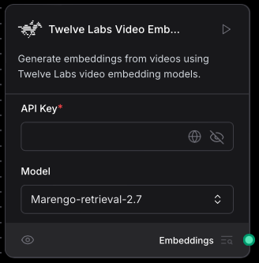

#### Twelve Labs Video Embeddings
- **Description**: Generate embeddings from videos using Twelve Labs video embedding models
- **Inputs**:
  - API Key (required)
  - Model (default: "Marengo-retrieval-2.7")
- **Output**: Video embeddings
- **Video Requirements**:
  - Resolution: Must be at least 360x360 and not exceed 3840x2160
  - Aspect Ratio: Must be one of 1:1, 4:3, 4:5, 5:4, 16:9, or 9:16
  - Duration: Between 4 seconds and 2 hours (7,200s)
  - File Size: Must not exceed 2 GB
  - Formats: Must be encoded in formats supported by FFmpeg

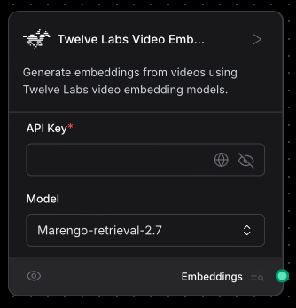

### Video Understanding

Twelve Labs Pegasus is a multimodal video understanding model that can analyze videos holistically, considering visuals, sounds, spoken words, and text. Unlike conventional models that rely solely on transcriptions, Pegasus captures the full context and relationships between different elements in the video.

Note: Before using Pegasus, videos must be indexed. The indexing process prepares the video for analysis and enables the model to understand and answer questions about its content.

#### Twelve Labs Pegasus
- **Description**: Chat with videos using Twelve Labs Pegasus API
- **Inputs**:
  - Video ID (for previously indexed videos)
  - Video Data (from Video File component - not required if Video ID provided)
  - API Key (required)
  - Prompt message (max 375 tokens)
  - Temperature (0.0 to 1.0, default: 0.7)
  - Index Name (required if Index ID not provided)
  - Index ID (required if Index Name not provided)
  - Model Name (default: "pegasus1.2")
- **Outputs**:
  - Response message - The AI's response to your prompt about the video
  - Video ID - Unique identifier for the processed video

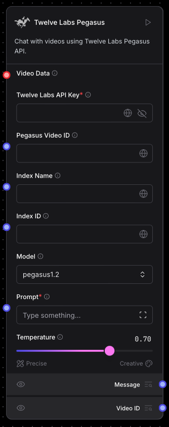

#### Pegasus Index Video
- **Description**: Indexes videos using Twelve Labs Pegasus API and appends index and video id infomration to the file metadata.
- **Inputs**:
  - Video Data (required) - List of video data objects from `Video File` or `Split Video` components
  - API Key (required)
  - Model Name (default: "pegasus1.2")
  - Index Name (required if Index ID not provided)
  - Index ID (required if Index Name not provided)
- **Outputs**:
  - Indexed Data - List of data objects with updated metadata containing:
    - video_id: Unique identifier for the indexed video
    - index_id: ID of the index used
    - index_name: Name of the index used

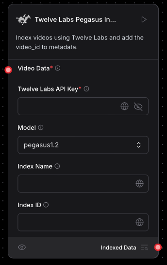

### Helper Functions

#### Video File
- **Description**: Loads video files in common formats
- **Input**: Video file (supports mp4, avi, mov, mkv, webm, flv, wmv, mpg, mpeg, m4v, 3gp, 3g2, m2v, mxf, dv, vob, ogv, rm, rmvb, amv, divx, m2ts, mts, ts, qt, yuv, y4m)
- **Output**: Data object containing:
  - `text`: The file path of the video
  - `metadata`: Dictionary containing:
    - `source`: The file path of the video
    - `type`: Set to "video"
    - `size`: File size in bytes

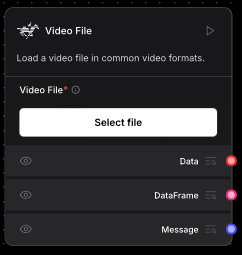

#### Split Video
- **Description**: Splits a video into multiple clips of specified duration
- **Inputs**:
  - Video Data (from `Video File` or `Split Video` component)
  - Clip Duration (seconds, default: 30)
  - Last Clip Handling:
    - Truncate: Skip the final clip if shorter than specified duration
    - Overlap Previous: Start final clip earlier to maintain full duration
    - Keep Short: Keep final clip at its natural length
  - Include Original (boolean, default: false)
- **Output**: List of Data objects, each containing:
  - `text`: Path to the clip file
  - `metadata`: Dictionary containing:
    - `source`: Path to original video
    - `type`: Set to "video"
    - `clip_index`: Index of the clip (-1 for original if included)
    - `start_time`: Start time in seconds
    - `end_time`: End time in seconds
    - `duration`: Clip duration in seconds
    - `original_video`: Information about the source video
    - `clip`: Detailed clip information including timestamp range

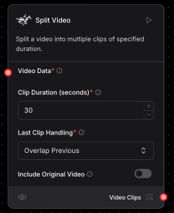

#### Convert AstraDB to Pegasus Input
- **Description**: Extracts Twelve Labs index_id and video_id from AstraDB search results
- **Inputs**:
  - AstraDB Results (required) - Search results from AstraDB component
- **Outputs**:
  - Index ID - Extracted index_id from the AstraDB result metadata
  - Video ID - Extracted video_id from the AstraDB result metadata

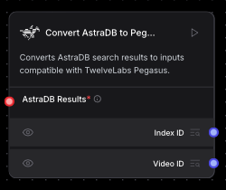

## Example Flows

### Pegasus Chat with Video

1. Use the `Video File` component to upload a video.
2. Connect the `Data` output from the  `Video File` component to the `Video Data` input in the `Twelve Labs Pegasus` component.
3. Enter your `Twelve Labs API Key` in the `Twelve Labs Pegasus` component and create an index name in `Index Name`
4. Connect a `Chat Input` component to the `Prompt` input in the `Twelve Labs Pegasus` component.
5. Connect a `Chat Output` to the `Message` ouptut of the `Twelve Labs Pegasus` component.
6. Optionally connect a `Chat Output` to the `Video ID` ouptut of the `Twelve Labs Pegasus` component if you want the video id output in the chat - you can enter this video id into `Pegasus Video ID` to continue to chat with the video without having to reindex the video every time.
7. Open the playground and ask a question about your video

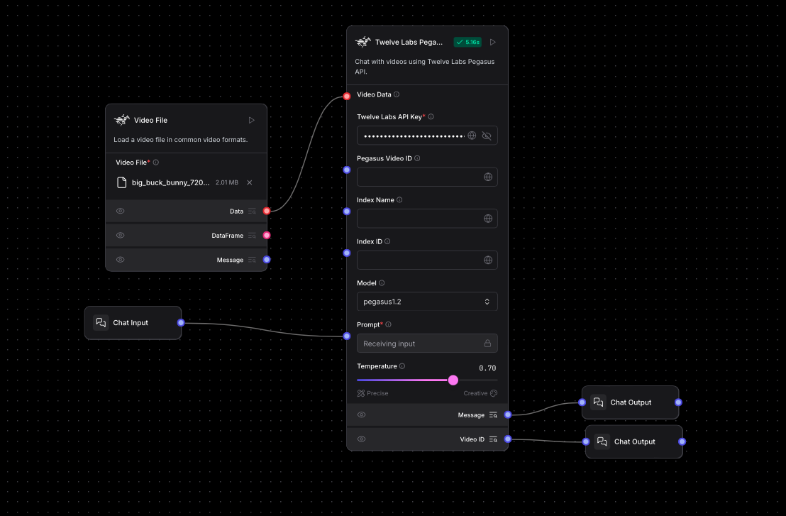

### Video Embeddings with Marengo and AstraDB

This flow shows how to generate and store video embeddings using Marengo and AstraDB:

Set up AstraDB:
   - Create a database following the [AstraDB setup guide](https://docs.datastax.com/en/astra-db-serverless/databases/create-database.html)
   - Generate an application token from the Database Details section
   - Create a `video_embeddings` collection with vector type and dimension 1024 (see [collection management guide](https://docs.datastax.com/en/astra-db-serverless/databases/manage-collections.html#create-collection))

Set up the Flow:

1. Use the `Video File` component to upload a video.
2. Add your `API Key` to a `Twelve Labs Video Embeddings` component.
3. Add your `Astra DB Application Token` to an `Astra DB` component. Select your `Database` and `Collection`.
4. Connect the `Embeddings` output from the `Twelve Labs Video Embeddings` component to the `Embedding Model` input in the `Astra DB` component.
5. Connect the `Data` output from the `Video File` component to the `Ingest Data` input in the `Astra DB` component.
6. Run the `Astra DB` component to embed the video.

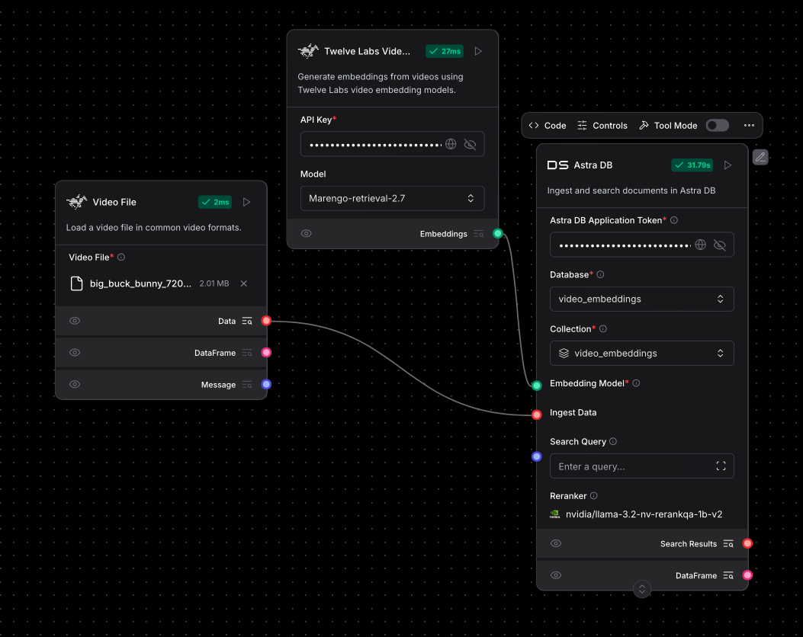

### RAG Example

This flow demonstrates how to build a video RAG (Retrieval Augmented Generation) system using Twelve Labs components and AstraDB:

#### Part 1: Split Video, Index Clips with Pegasus, and Save Embeddings to Astra DB

This part of the flow demonstrates how to split a video into clips, index each clip with Pegasus, generate embeddings for each clip, and store all the resulting data in Astra DB for efficient retrieval and downstream analysis.

1. Use the `Video File` component to upload your video
2. Connect the `Data` output to the `Video Data` input in the `Split Video` component
3. Configure the `Split Video` component:
   - Set `Clip Duration` to 30 seconds
   - Choose `Last Clip Handling` based on your needs
   - Enable `Include Original` if you want to keep the full video
4. Connect the `Data` output from `Split Video` to the `Video Data` input in the `Pegasus Index Video` component
5. Add your `API Key` to the `Pegasus Index Video` component
6. Create an index name in the `Index Name` field
7. Connect the `Indexed Data` output to the `Video Data` input in the `Twelve Labs Video Embeddings` component
8. Add your `API Key` to the `Twelve Labs Video Embeddings` component
9. Connect the `Embeddings` output to the `Embedding Model` input in the `Astra DB` component
10. Add your `Astra DB Application Token` to the `Astra DB` component
11. Select your `Database` and `Collection` in the `Astra DB` component
12. Connect the `Indexed Data` output from `Pegasus Index Video` to the `Ingest Data` input in the `Astra DB` component
13. Run the flow to process your video:
    - The video will be split into clips
    - Each clip will be indexed with Pegasus
    - Video embeddings will be generated
    - All data will be stored in AstraDB

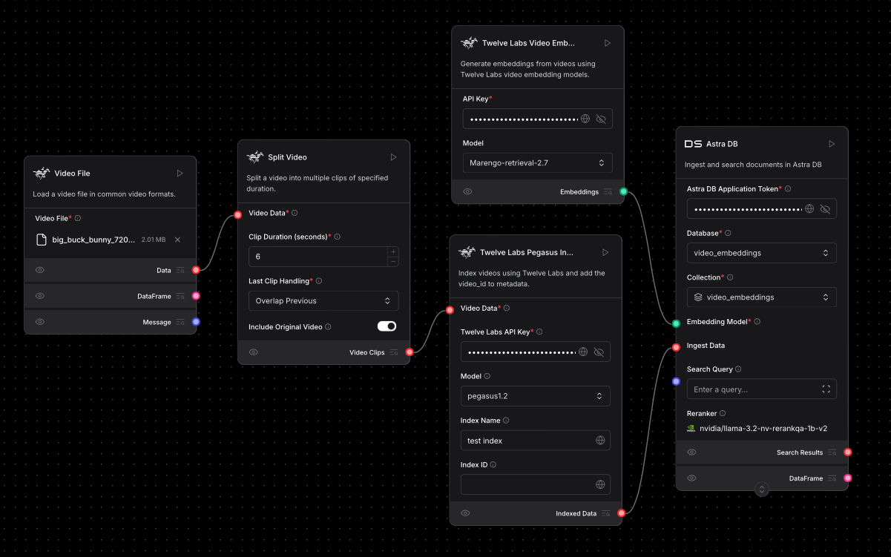

#### Part 2: Query Video Embeddings and Chat with Video using Pegasus

This part of the flow demonstrates how to perform retrieval-augmented question answering over your indexed video collection using text queries and the Pegasus model:

2. Connect a `Chat Input` to the `Search Query` input of the `Astra DB` component.
3. In the `Astra DB` component, provide your Astra DB Application Token, select the appropriate Database and Collection, and ensure the correct Embedding Model is set (connected from your embedding pipeline).
4. Connect the `Search Results` output from the `Astra DB` component to the `AstraDB Results` input of the `Convert AstraDB to Pegasus Input` component.
6. Connect the `Index ID` and `Video ID` outputs from the `Convert AstraDB to Pegasus Input` component to the corresponding `Index ID` and `Pegasus Video ID` inputs of the `Twelve Labs Pegasus` component.
7. Connect the original `Chat Input` (your question) to the `Prompt` input of the `Twelve Labs Pegasus` component.
8. Enter your Twelve Labs API Key in the `Twelve Labs Pegasus` component and select the desired model (default: pegasus1.2).
9. Connect the `Message` output from the `Twelve Labs Pegasus` component to the `Chat Output` component to display the AI’s response.
10. Open the playground and ask a question. The flow will embed the question, find the most relevant video/video segment, and use Pegasus to query that video/video segment with your question.

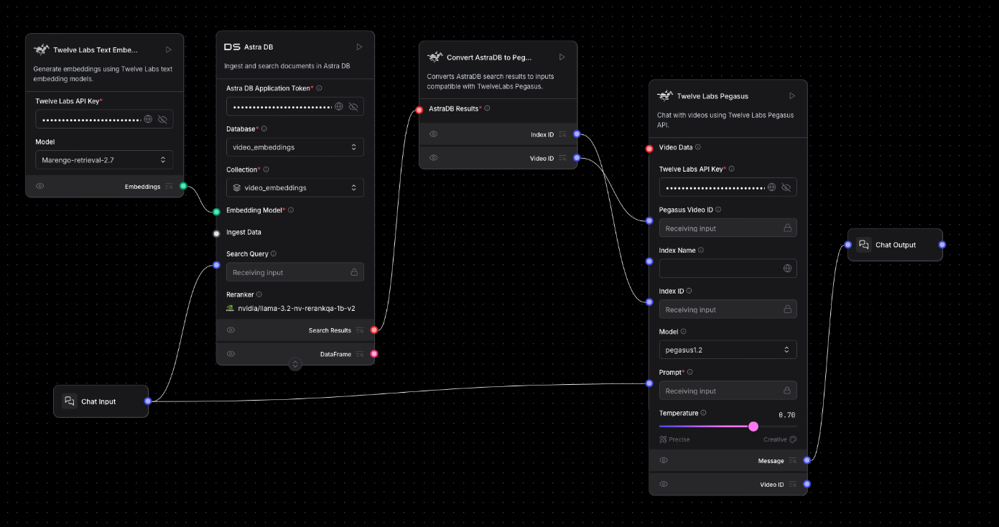 