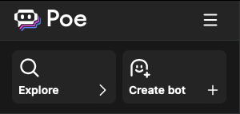
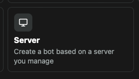
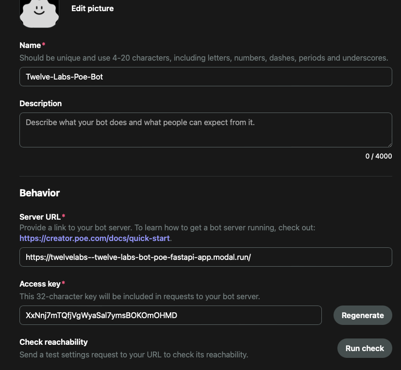
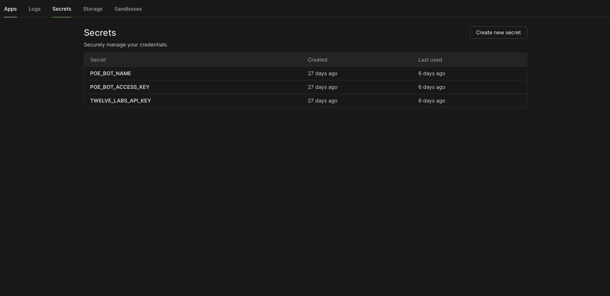
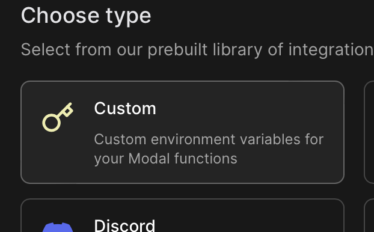
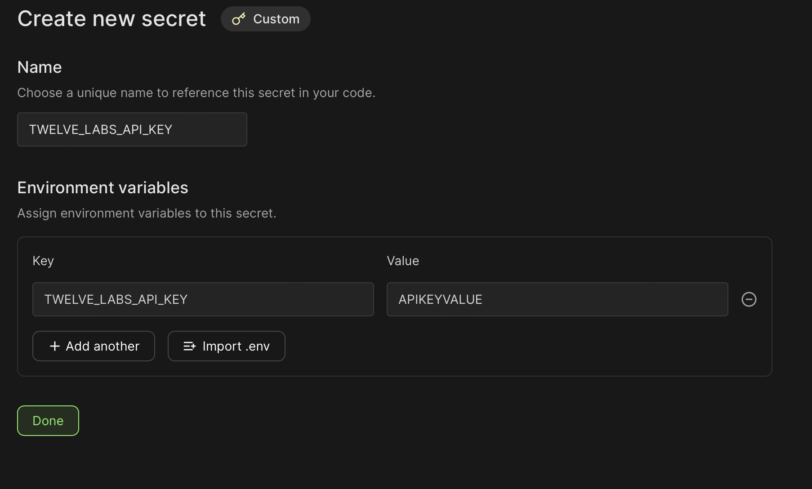
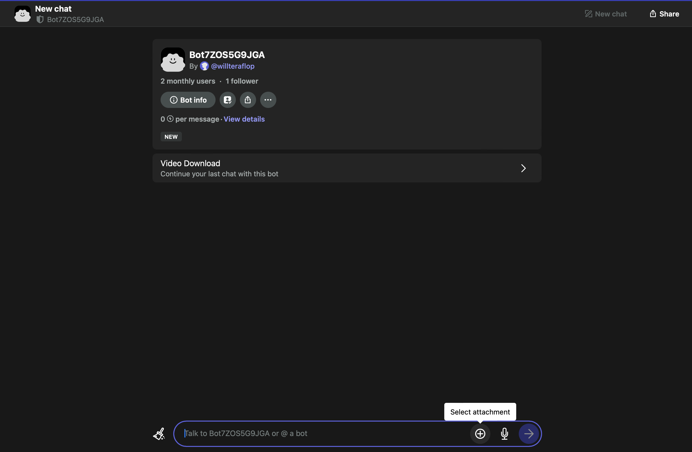
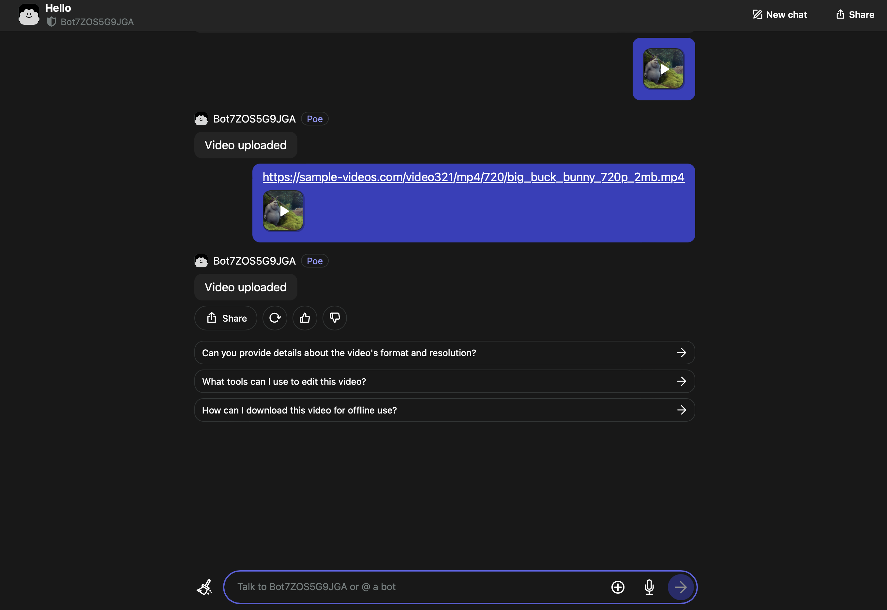
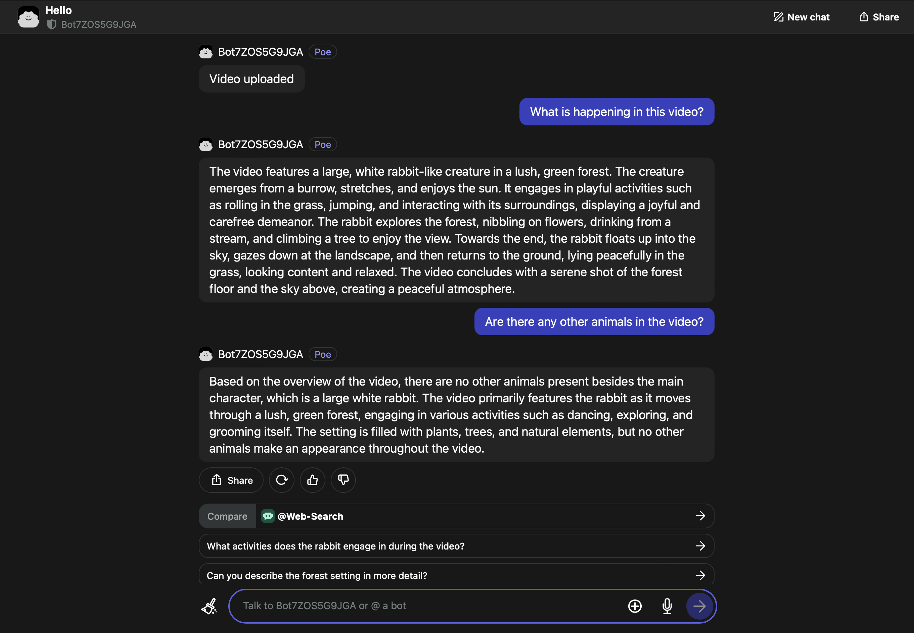

# Twelve Labs Poe Bot

Deploy Twelve Labs Poe Bot hosted on Modal.<br> 
Much of this content is from [Poe Bot Quick Start](https://creator.poe.com/docs/quick-start).

## Set Up Modal

1. Install Modal
    ```
    pip3 install modal
    ```
2. Create a new Modal token
    ```
    modal token new --source poe
    ```
3. You will be taken to your web browser to log into Modal. After logging in, click "create token" to create a Modal token
4. Close the browser - you are ready to use Modal

## Deploy to Modal (Development)

1. Run this command to serve the Bot on Modal in development mode
```
modal serve twelve_labs_poe_bot.py
```
This will deploy your app until the command stops running. It will also deploy changes to the code as they are saved. 

2. Locate your application's `Modal Endpoint` in the terminal. You will use this to set up your Poe Bot in the next step


## Create a Poe Bot

1. Go to [Poe Bot](https://poe.com/) and create an account
2. Follow this link to the [Bot Creation Page](https://poe.com/create_bot) or click `Create Bot` on the top left



3. Select `Sever Bot`



4. Enter your Bot's `Modal Endpoint` in the `Server Url` field



5. Enter information for your Bot
6. Copy the `Access Key` and `Name` for use in the next step

## Update Modal Secrets

1. Go to the [Secrets tab in your Modal Dashboard](https://modal.com/secrets)


2. Click "Create New Secret" and choose "Custom Secret"



3. Create all 3 secrets

- `ACCESS_KEY` is  `Access Key` from the previous step.
- `BOT_NAME` is `Name` from the previous step.
- Get `TWELVE_LABS_API_KEY` from the the [Twelve Labs Dashboard](https://playground.twelvelabs.io/dashboard/api-key)



4. Optional Pricing Test Mode Secret in Modal

Setting `TEST_MODE` to `true` reduces all costs by a factor of 100, making it easier to test the bot without using too many points. In test mode:
- Video indexing costs are reduced from $0.33 to $0.0033 per minute
- Audio indexing costs are reduced from $0.0083 to $0.000083 per minute
- Storage costs are reduced from $0.0015 to $0.000015 per minute
- Token costs are reduced proportionally

Remember to delete `TEST_MODE` or set it to `false` for production use. If it does not exist, it will automatically be read as false.

## Chat with your Bot

1. Go to your Bot
    - Go to [Poe Bot](https://poe.com/), click `Your Bots`, and find the Bot you just created,
    - Or, navigate to `https://poe.com/[BOT_NAME]`
2. Upload a video
    - From your computer
    
    - Or, by entering a video url in chat such as `https://sample-videos.com/video321/mp4/720/big_buck_bunny_720p_2mb.mp4`
    
3. Wait for the video to upload: The Bot will say `Video uploaded`
4. Chat with your video
    

Uploading a new video will replace the old video and allow you to chat with the new video.

## Deploy to Modal (Production)

To persist your Bot on Modal, run `modal deploy twelve_labs_poe_bot.py`.

**IMPORTANT** Be sure to update the Poe Server URL to the new Modal endpoint. It will not have `-dev` in the name if you used `modal deploy`


